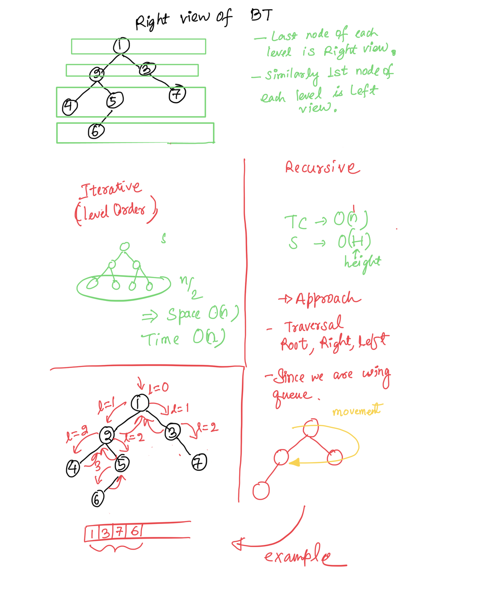

Approach 1: Iterative Approach

1. Use level order traversal.
2. Last Element of each level is the Right view
3. For Right View push left node first & right node second.

Intuition: In a queue First In First Out (so push Right node first)

```c++
vector<int> rightSideView(TreeNode* root) {
    vector<int> ans;
    if(!root) return ans;
    queue<TreeNode*> q;
    q.push(root);
    while(!q.empty()) {
        int n = q.size();
        ans.push_back(q.front()->val);
        for(int i=0;i<n;++i) {
            TreeNode *cur = q.front();
            q.pop();
            if(cur->right) q.push(cur->right);
            if(cur->left) q.push(cur->left);
        }
    }
    return ans;
}
```

=> Time Complexity = O(n)
=> Space Complexity = O(n)

Approach 2: Recursion => Space Optimization

1. Use a vector to store Right view.
2. Use recursion to store the result & pass a variable to keep track of the level, intiiallly 0.
3. if size of vector same as level add node value to vector.
4. For Right View push right node first & vice versa for Left View.

```c++
void f(TreeNode *node, int level,vector<int> &ans) {
    if(!node) return;
    if(ans.size() == level) ans.push_back(node->val);
    if(node->right) f(node->right,level+1,ans);
    if(node->left) f(node->left,level+1,ans);
}
vector<int> rightSideView(TreeNode* root) {
    vector<int> ans;
    f(root,0,ans);
    return ans;
}
```

=> Time Complexity = O(n)
=> Space Complexity = O(Height Of BT)
