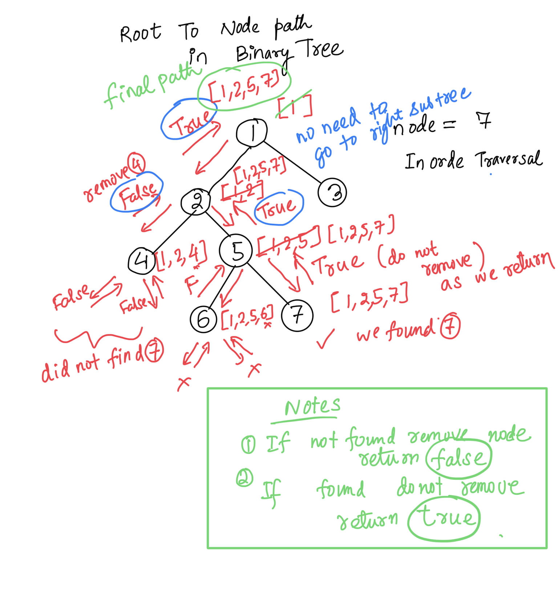
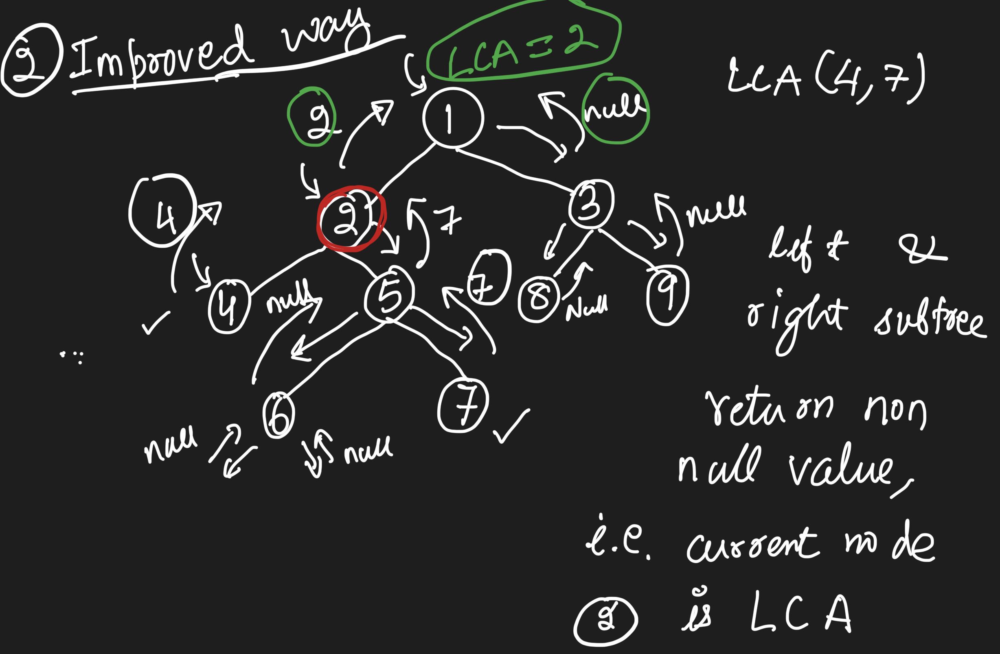

### LCA Bruteforce

- get root to node path for two nodes
- get last macthed node value & return it as Lowest Common Ansestor.

path1: 3 5
path2: 3 5 2 4
LCA: 5



CODE:

```c++
bool getPath(TreeNode *node, TreeNode *x, vector<TreeNode*> &path) {
    if(!node) return false;
    path.push_back(node);
    if(node->val == x->val) return true;
    if(getPath(node->left, x, path) || getPath(node->right, x, path)) {
        return true;
    }
    path.pop_back();
    return false;
}
```

Time O(n)
Space O(n)+O(n) (Extra O(n) space due to stored path)

### Improved with space efficient



- do dfs and return a node if it found
- if left subtree return node & right subtree null or vice versa return node

```c++
TreeNode* lowestCommonAncestor(TreeNode* node, TreeNode* p, TreeNode* q) {
    if(!node || node == p || node == q) {
        return node;
    }
    TreeNode *left = lowestCommonAncestor(node->left,p,q);
    TreeNode *right = lowestCommonAncestor(node->right,p,q);
    // If the left subtree returns a non-null node, it means one of the target nodes (or the LCA for them) is in the left subtree.
    if(!left) return right;
    // Similarly, if the right subtree returns a non-null node, the other target node (or its LCA) is in the right subtree.
    else if(!right) return left;
    // When both subtrees return non-null, it implies that the current node is the lowest common ancestor, as it is the first point where the paths to both nodes meet.
    else return node; //
}
```
